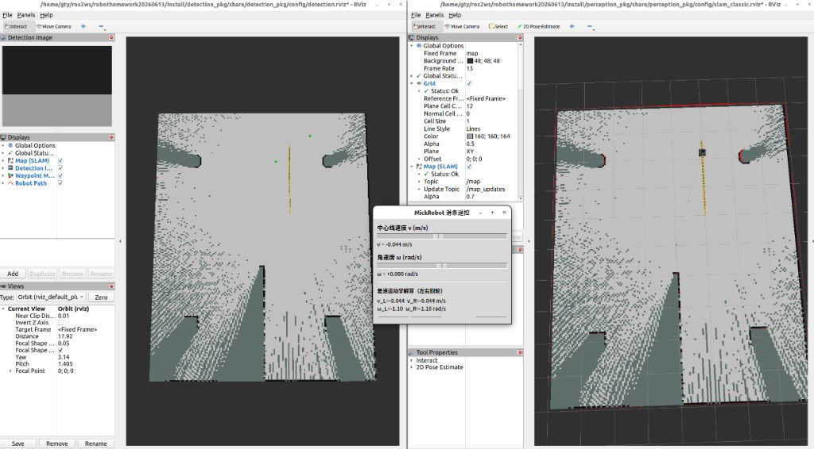
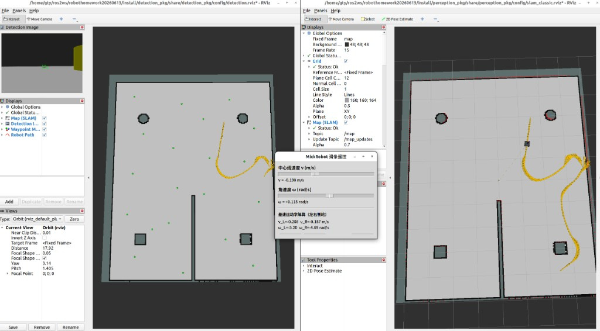
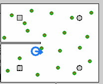
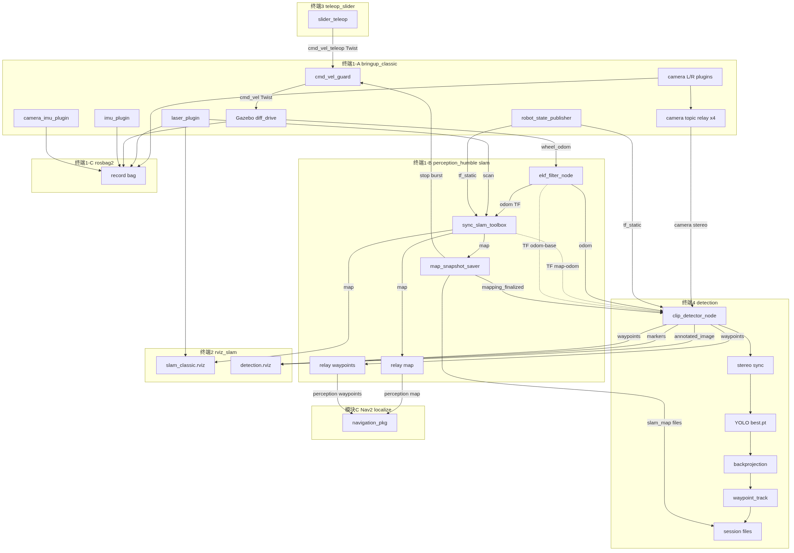
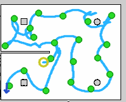
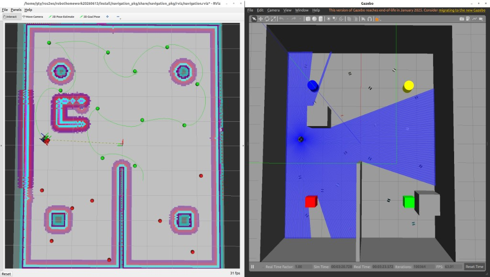
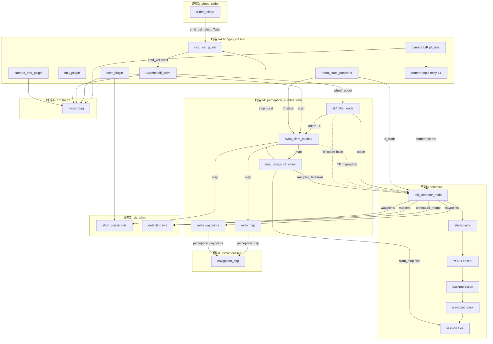

# 4WheelDetectionRobot — MickRobot 仿真 / SLAM / YOLO 回形针检测 / 导航

> 原工作空间目录名 `robothomework20260613`；GitHub 仓库名 **4WheelDetectionRobot**。

## 环境说明

| 环境 | 系统 | ROS 2 | 仿真器 | 配置脚本 |
|------|------|-------|--------|----------|
| **本机（当前）** | Ubuntu 22.04 | Humble | **Gazebo Classic 11** | `setup_humble.sh` |
| 组员开发机 | Ubuntu 24.04 | Jazzy | Gazebo Sim (gz-sim) | `setup.sh` |

本仓库已完成 **22.04 + Humble + Gazebo Classic** 迁移；24.04/Jazzy 相关代码**保留并注释**，未删除。

---

## 系统演示

### 图 1 — 四终端一键启动效果

`python3 scripts/launch_mapping_terminals.py --kill-first` 依次打开：**仿真+SLAM+录包**、**RViz 双窗口**、**滑条遥控**、**YOLO 检测**。左为 `detection.rviz`（检测图 + 航点），右为 `slam_classic.rviz`（地图 + 激光 + 轨迹），中间为 MickRobot 滑条 GUI。



### 图 2 — 同步 SLAM 建图与 YOLO 检测

机器人在 `small_house` 中巡逻/遥控建图的同时，左目 YOLO 实时检测回形针并反投影到 `map` 帧；RViz 左窗显示绿框检测图与绿色航点球，右窗显示 slam_toolbox 栅格地图与黄色 `/odom` 轨迹。



### 图 3 — 检测航点（绿）与 GT 真值（红）比对

会话 `map_20260614_185137` 落盘图：**绿色圆** = YOLO 地面反投影 + 地图空间去重后的航点；**红色十字** = `paperclips_small_house.yaml` 中 Gazebo 真值；**蓝色箭头** = 建图结束位姿。绿点与红点对齐表明 TF 运动补偿 + 地面求交反投影已收敛。



### 图 4 — 话题与消息通讯全图（四终端建图）

下图覆盖 **模块 A（仿真）→ B（SLAM/EKF）→ E（检测）→ RViz/落盘** 的全部 ROS 2 话题、服务、TF 与文件输出。定位/导航模式（AMCL + Nav2）见 [docs/TOPIC_COMMUNICATION.md](docs/TOPIC_COMMUNICATION.md)。



### 图 5 — 航点巡逻任务轨迹（`path_20260615_001514`）

模块 C 一次 TSP 巡逻落盘图：**浅蓝线** = 里程计行驶轨迹；**绿圆** = 已驻留航点（20/20）；**蓝圈/橙箭头** = 起点与终点位姿。会话 `path_20260615_001514`，地图来自 `map_20260614_185137`。



### 图 6 — AMCL 定位 + Nav2 航点巡逻（RViz + Gazebo）

`launch_navigation_terminals.py` 一键启动后：左为 `navigation.rviz`（静态地图、膨胀代价层、全局/局部路径、绿点航点与已走轨迹）；右为 Gazebo 仿真（激光扇形、彩色柱体障碍与 MickRobot 实车运动）。地图来自 `map_20260614_185137`，航点来自同会话 `waypoints.yaml`。



<details>
<summary>Mermaid 源码（本地预览可编辑，GitHub 对部分字符支持有限）</summary>



源文件：[docs/fig4-topic-communication.mmd](docs/fig4-topic-communication.mmd) · SVG：[docs/screenshots/fig4-topic-communication.svg](docs/screenshots/fig4-topic-communication.svg)

</details>

**TF 树（建图时 Fixed Frame = `map`）**

```text
map -- slam_toolbox --> odom -- ekf_filter_node --> base_footprint -- robot_state_publisher --> base_link
                                                                                              +- laser_link       scan
                                                                                              +- imu_link         imu/data
                                                                                              +- camera_imu_link  camera/imu/data
                                                                                              +- camera_left_link 左目 REP-103
                                                                                              +- camera_right_link 右目 baseline 7.5cm
```

<details>
<summary>图4 话题明细（点击展开）</summary>

**控制链**

| 话题 | 类型 | 发布 → 订阅 | 说明 |
|------|------|-------------|------|
| `/cmd_vel_teleop` | `Twist` | slider_teleop → cmd_vel_guard | v, ω @20Hz |
| `/cmd_vel` | `Twist` | cmd_vel_guard → diff_drive | 唯一写 Gazebo；30Hz 零速守护 |
| `/teleop/wheel_speeds` | `Float64MultiArray` | slider_teleop → — | 调试轮速 |

**Gazebo 传感器（模块 A）**

| 话题 | 类型 | 帧 | 频率 |
|------|------|-----|------|
| `/wheel/odom` | `Odometry` | odom→base_footprint | 50Hz |
| `/scan` | `LaserScan` | laser_link | 10Hz, 360点 |
| `/imu/data` | `Imu` | imu_link | 100Hz |
| `/camera/imu/data` | `Imu` | camera_imu_link | 100Hz, 不进EKF |
| `/camera/left/image_raw` | `Image` | camera_left_link | 30Hz, RELIABLE |
| `/camera/right/image_raw` | `Image` | camera_right_link | 30Hz |
| `/camera/left/camera_info` | `CameraInfo` | — | 内参 K |
| `/camera/right/camera_info` | `CameraInfo` | — | 内参 K |
| `/joint_states` | `JointState` | — | 30Hz |

相机 relay：`camera_*_sensor/*` → `/camera/*/image_raw` 与 `camera_info`（bringup_classic 启动 5s 后）

**SLAM / EKF（模块 B）**

| 话题 / TF | 类型 | 发布 → 订阅 |
|-----------|------|-------------|
| `/odom` | `Odometry` | ekf_filter_node → slam_toolbox, clip_detector |
| `/map` | `OccupancyGrid` | slam_toolbox → saver, RViz, relay |
| `/perception/map` | `OccupancyGrid` | relay → Nav2 |
| `map→odom` | TF | slam_toolbox |
| `odom→base_footprint` | TF | ekf_filter_node |

**检测（模块 E）clip_detector_node**

| 话题 | 类型 | 方向 |
|------|------|------|
| `/detection/annotated_image` | `Image` | 发布 → detection.rviz |
| `/detection/markers` | `MarkerArray` | 发布 → detection.rviz |
| `/detection/waypoints` | `PoseArray` | 发布 → relay, RViz |
| `/perception/waypoints` | `PoseArray` | relay → Nav2 |
| `/perception/mapping_finalized` | `Empty` | saver → clip_detector |

内部流水线：`ApproximateTimeSynchronizer` → YOLO(`simmodel/best.pt`) → 地面求交反投影 + `motion_compensation` TF 合成 → `waypoint_track` 地图空间关联 + OSNet ReID → 落盘

**服务与落盘**

| 名称 | 类型 | 说明 |
|------|------|------|
| `/map_snapshot_saver/save_map` | `Trigger` | 滑条退出 / 手动存图 |
| `waypoints.yaml` | 文件 | 每秒 + 退出时写入 |
| `slam_map_waypoints.png` | 文件 | 绿点航点 + 红叉 GT |
| `slam_map.yaml/.pgm` | 文件 | 栅格地图 |
| `initial_pose.yaml` | 文件 | AMCL 初值 |
| `bag/` | rosbag2 | 含 camera, scan, odom, tf |

**录包话题**：`/scan` `/odom` `/wheel/odom` `/imu/data` `/camera/imu/data` `/camera/*` `/map` `/tf` `/tf_static` `/cmd_vel` `/cmd_vel_teleop` `/clock`

</details>

## 快速开始（本机 Ubuntu 22.04）

```bash
cd /home/gty/ros2ws/robothomework20260613

# 首次：安装依赖并编译（需 sudo）
bash setup_humble.sh

# 日常：加载环境
source env_humble.bash
```

### 建图（四终端）

启动后终端 1 会创建 `maps/map_<时间戳>/` 并将 **`map_latest` 指向本次会话**；终端 4 可直接用 `map_latest`，无需抄时间戳。

| 终端 | 作用 | Launch |
|------|------|--------|
| **1** | 仿真 + SLAM + 录包 | `humble_sim_slam.launch.py` |
| **2** | RViz（地图/激光/检测图/航点） | `rviz_slam.launch.py` |
| **3** | 滑条遥控 | `teleop_slider.launch.py` |
| **4** | YOLO 检测 + 航点反投影 | `detection_pkg detection.launch.py` |

地图输出到 `src/perception_pkg/maps/map_<时间戳>/`：

| 文件 | 说明 |
|------|------|
| `slam_map.yaml` / `.pgm` / `.png` | 栅格地图（无航点） |
| `waypoints.yaml` | 检测反投影航点（去重 + 外观重识别后写入） |
| `slam_map_waypoints.png` | 地图 + **绿色检测航点** + **红色 GT 回形针** + **橙色终止位姿箭头** |
| `initial_pose.yaml` | `map` 帧下 `x, y, yaw`（建图时每秒更新，供 AMCL） |
| `session_meta.json` | 会话元数据 |
| `bag/` | 本次 rosbag（默认开启录包） |
| `map_latest` | 符号链接 → 最近一次 `map_*` |

关闭录包：终端 1 加 `record_bag:=false record_db:=false`。

定位阶段加载先验：

```bash
ros2 launch perception_pkg perception_humble.launch.py use_sim:=true mode:=localize \
  initial_pose_file:=src/perception_pkg/maps/map_<时间戳>/initial_pose.yaml
```

#### 方式一：一键启动 4 终端

每隔 2s 依次打开上表四个窗口，自动 `source env_humble.bash`：

```bash
python3 scripts/launch_mapping_terminals.py

# 推荐：先清僵尸 Gazebo 再启动
python3 scripts/launch_mapping_terminals.py --kill-first

# 间隔 3s；无图形终端时用 tmux
python3 scripts/launch_mapping_terminals.py --delay 3
python3 scripts/launch_mapping_terminals.py --tmux
```

指定终端模拟器：`TERMINAL=gnome-terminal python3 scripts/launch_mapping_terminals.py`

#### 方式二：分终端启动

**终端 1** — 仿真 + SLAM + **录包**（默认 `record_bag:=true`）：

```bash
source env_humble.bash
ros2 launch perception_pkg humble_sim_slam.launch.py
# SSH / headless：gui:=false
```

录包输出：`src/perception_pkg/maps/map_<时间戳>/bag/`。

**结束建图（Ctrl+C 顺序建议）：**

1. **终端 4** 检测 — Ctrl+C（自动存 `waypoints.yaml` + `slam_map_waypoints.png`）
2. **终端 1** `humble_sim_slam` — Ctrl+C（存 `slam_map.*`；`initial_pose.yaml` 建图过程中已每秒更新）
3. 终端 2 RViz / 终端 3 遥控 — 随时 Ctrl+C

> 若先停终端 1 再停终端 4，航点需在终端 4 退出时自行保存（已支持）。`initial_pose.yaml` 在 SLAM 运行期间会持续写入，不依赖退出瞬间的 TF。

**终端 2** — RViz（双窗口，避免 segfault；均需 `use_sim_time`）：

```bash
source env_humble.bash
ros2 launch perception_pkg rviz_slam.launch.py
# 仅建图窗口：with_detection:=false
```

| 窗口 | 配置 | 内容 |
|------|------|------|
| 1 | `slam_classic.rviz` | `/map` `/scan` 机器人 |
| 2 | `detection.rviz` | `/detection/annotated_image` `/detection/markers` |

> `slam_classic.rviz` **不能**内嵌 Image 显示（本机 RViz 会 exit -11）。检测单独窗口。

**终端 3** — 滑条遥控（关闭窗口或点「保存地图」会调用 `save_map` 服务）：

```bash
source env_humble.bash
ros2 launch perception_pkg teleop_slider.launch.py
```

**终端 4** — 目标检测 + 双目反投影（须**先**启动终端 1，再启 detection）：

```bash
source env_humble.bash
ros2 launch detection_pkg detection.launch.py
# 等价于（默认已指向 map_latest）：
# ros2 launch detection_pkg detection.launch.py \
#   session_dir:=src/perception_pkg/maps/map_latest
```

> **`session_dir` 默认 `map_latest`**：终端 1 启动时会自动把符号链接指到本次 `map_<时间戳>`。若未先启终端 1 就启 detection，航点可能写入**上一次**会话。

修改代码后请先编译：

```bash
colcon build --packages-select detection_pkg perception_pkg --allow-overriding perception_pkg
source install/setup.bash
```

首次使用需创建**轻量隔离层**（仅需一次）：

```bash
bash scripts/setup_detection_venv.sh
```

> **前提**：终端 1 运行中；机器人经过回形针；仿真必须 `use_sim_time:=true`（launch 默认已开）。

反投影几何遵循 [docs/SIM_DATASET_PROJECTION_FIX.md](docs/SIM_DATASET_PROJECTION_FIX.md)（REP-103 右乘光学修正）。航点处理分三层：

1. **实时合并**（`_add_waypoint`）：**OSNet 深度 ReID**（`embedding_reid.py`，失败自动降级 ORB BoW）关联同一回形针；**1σ 深度融合**（`waypoint_track.py`）沿固定方位约束深度；`dedup_radius_m`（默认 **0.35 m**）作空间兜底。
2. **环形门控**：`min_depth_m`–`max_depth_m`（默认 0.6–7.0 m）与视差/高度/地图半径校验，过近过远或异常三角化不记航点。
3. **落盘**（每秒 + Ctrl-C / 建图结束）：`deduplicate_waypoints` 最终过滤，`waypoints.yaml` 为**去重后**列表（同簇保留置信度最高者）。

参数见 `src/detection_pkg/config/detection_params.yaml`：

| 参数 | 默认 | 说明 |
|------|------|------|
| `dedup_radius_m` | `0.45` | 空间去重半径（米）；同一回形针多次观测合并 |
| `enable_reid` | `true` | 外观重识别 |
| `reid_backend` | `osnet` | `osnet` 或 `orb`（OSNet 不可用时自动降级 ORB） |
| `reid_cosine_min` | `0.42` | OSNet 余弦相似度阈值 |
| `reid_match_score_min` | `0.42` | ORB fallback 阈值 |
| `min_depth_m` / `max_depth_m` | `0.6` / `7.0` | 环形反投影距离门控（米） |
| `sigma_floor_m` | `0.08` | 1σ 融合深度下限，避免样本过少时 σ→0 |
| `pixel_merge_u_px` / `pixel_merge_v_px` | `32` / `24` | 图像域合并：同一像素射线上的检测并为一航点 |
| `track_uv_ema` | `0.15` | 锚点像素 (u,v) 指数滑动均值 |
| `track_map_ema` | `1.0` | map 位置融合权重（1.0=直接 1σ 均值） |
| `max_angular_for_wp` | `0.12` | 转弯过快时不记航点（rad/s） |
| `max_linear_for_wp` | `0.20` | 线速度超过此不记航点（m/s） |
| `motion_settle_sec` | `0.4` | 高速/转弯后冷却（秒） |
| `use_odom_motion_gate` | `false` | 是否用 odom 角速度辅助门控 |
| `tf_prefer_image_stamp` | `true` | 反投影用图像时刻 TF |
| `stereo_sync_slop_sec` | `0.12` | 左右目时间对齐容差（秒） |
| `allow_ground_fallback` | `true` | 立体失败时地面求交兜底 |
| `marker_scale_m` | `0.08` | RViz 绿球直径（米） |

> **外观库仅在内存中**：一次建图跑到底时重识别持续有效；若**中途重启 detection 节点**，`waypoints.yaml` 里的坐标会加载，但外观 embedding 需重新观测才能建立（详见下方故障排查）。

原理：`clip_detector_wrapper.sh` 注入 `.detection-python/`；节点先加载 ROS，再从 `~/.local` 延迟加载 `ultralytics` / `torchreid`。首次使用 OSNet 需：`pip install --user torchreid`。相机话题 **RELIABLE** QoS。反投影仅用**检测框中心**；深度优先双目三角化 + 环形门控，失败则地面求交（同样经距离门控）。

离线补画航点图（已有 `waypoints.yaml` 时）：

```bash
python3 scripts/overlay_session_waypoints.py src/perception_pkg/maps/map_<时间戳>
```

---

## SLAM 算法（建图模式）

| 项目 | 当前实现 |
|------|----------|
| **包 / 节点** | `slam_toolbox` → `async_slam_toolbox_node` |
| **核心算法** | **Karto 2D 激光 SLAM**（相关扫描匹配） |
| **后端优化** | **Ceres Solver** 位姿图优化 |
| **传感器** | `/scan`（2D 激光）+ TF `odom→base_footprint`（Gazebo `diff_drive`） |
| **闭环** | `do_loop_closing: true` |
| **修正方式** | `map→odom` TF；EKF 融合 **`odom_wheel`(vx) + 底盘 `/imu/data`** → `/odom`（相机 IMU 位姿不同，单独发布） |
| **定位模式** | `mode:=localize` 时改用 **AMCL**（`nav2_amcl`），不再跑 slam_toolbox |

配置文件：`src/perception_pkg/config/slam_toolbox_params.yaml`、`ekf_sim.yaml`（仿真 EKF）。

**必须 rebuild 后重启仿真**（URDF diff_drive 与 EKF 有变更）：

```bash
colcon build --packages-select mickrobot_description perception_pkg --symlink-install
bash scripts/kill_sim.sh
ros2 launch perception_pkg humble_sim_slam.launch.py
```

验证 SLAM 是否在修正 odom：

```bash
python3 scripts/analyze_mapping_session.py src/perception_pkg/maps/map_<时间戳>
# 关注 map→odom 的 Δtx/Δty/偏航变化；全为 0 表示几乎未修正
```

> RViz 里黄色 `/odom` 轨迹箭头来自 **EKF 融合后的 `/odom`**（跟踪 Gazebo diff_drive 的 `/wheel/odom`，**非仿真真值**）。建图是否稳定看 **`map` 帧下** 地图与激光是否对齐、`map→odom` 是否平稳。详见 `docs/SLAM_DRIFT_ANALYSIS.md`。

---

## 模块 C：航点巡逻导航

**前提**：建图 + 检测已完成，`map_latest` 含 `slam_map.yaml`、`waypoints.yaml`、`initial_pose.yaml`（只读）。

**需要模块 A 仿真**：Gazebo **随机 spawn**（真值位姿）；AMCL 用 `initial_pose.yaml` 作 mapping 先验并重定位到真值（不移动 Gazebo）。

### 一键三终端

```bash
source env_humble.bash
colcon build --packages-select navigation_pkg perception_pkg --symlink-install
python3 scripts/launch_navigation_terminals.py --kill-first
```

| 终端 | 内容 |
|------|------|
| 1 | Gazebo 仿真 |
| 2 | AMCL 重定位 + Nav2 |
| 3 | RViz + 航点巡逻（最近航点 → 曼哈顿 TSP → 逐点驻留 2 s） |

流程：用 `initial_pose.yaml` 重定位 → 驶向最近航点 → 构建曼哈顿距离矩阵并 Held-Karp TSP → 按序访问；RViz **红球**未访问、**绿球**已驻留 2 s。

### 任务结果与回放

轨迹写入 `src/navigation_pkg/result/path_<时间戳>/`，`path_latest` 指向最近一次。示例轨迹见 [图 5](#图-5--航点巡逻任务轨迹path_20260615_001514)（`path_20260615_001514`）。

```bash
ros2 run navigation_pkg playback_mission.py --rate 2.0
```

主 TSP 循环中导航重试耗尽时，航点会**延后**到 sweep 补访（默认 4 轮、接近容差 0.55 m、每点 6 次重试），而不是直接跳过结束任务。仍失败时可手动补点（Nav2 须在终端 2 运行）：

```bash
ros2 run navigation_pkg send_goal.py -2.9976 -1.5102 0   # id=4
ros2 run navigation_pkg send_goal.py -4.2137 -2.7961 0   # id=8
```

详见 [`src/navigation_pkg/开发文档_C.md`](src/navigation_pkg/开发文档_C.md) 与 [`src/navigation_pkg/result/README.md`](src/navigation_pkg/result/README.md)。

---

## 包结构（已整合至 `src/`）

| 包名 | 目录 | 说明 |
|------|------|------|
| `mickrobot_description` | `src/mickrobot_description/` | 模块 A：URDF、Gazebo、世界文件 |
| `perception_pkg` | `src/perception_pkg/` | 模块 B：slam_toolbox + AMCL |
| `navigation_pkg` | `src/navigation_pkg/` | 模块 C：Nav2 导航 |
| `detection_pkg` | `src/detection_pkg/` | 模块 E：YOLO 检测 + 双目航点反投影 |

原 `A/`、`B/`、`C/` 三个顶层目录已与 `src/` 整合并删除（内容不完全相同，`src/` 为权威版本）。

---

## TaskA v5 机器人模型

已从 `TaskA_交付物_v5.zip` 更新**仿真参数与机器人模型**（传感器外参变更）：

- 顶部板件 `top_payload_link` + 装配 mesh `board_camera_radar_assembly.stl`
- 雷达：`laser_joint` → `xyz="-0.0135 0 0.158031"`
- 相机（OAK 双目 + RGB 参考帧）：
  - 左目：`0.0357 0.007274 0.149031`
  - RGB：`0.0357 -0.0305 0.149031`
  - 右目：`0.0357 -0.068274 0.149031`

URDF/xacro 文件：

| 文件 | 用途 |
|------|------|
| `mickrobot_ugv.urdf.xacro` | Ubuntu 24.04 + Jazzy + gz-sim |
| `mickrobot_ugv_classic.urdf.xacro` | **Ubuntu 22.04 + Humble + Gazebo Classic** |

世界文件：

| 文件 | 用途 |
|------|------|
| `worlds/small_house.world` | Gazebo Classic（本机） |
| `worlds/small_house_gz.world` | gz-sim（24.04，原 `small_house.world` 保留） |

---

## 迁移改动摘要（22.04 / Humble）

以下文件为 **Humble 迁移新增**，Jazzy 原版保留：

| 新增/修改 | 说明 |
|-----------|------|
| `bringup_classic.launch.py` | Classic 仿真入口 |
| `mickrobot_ugv_classic.urdf.xacro` | Classic Gazebo 插件（libgazebo_ros_*） |
| `worlds/small_house.world` | Classic 格式室内世界 |
| `perception_humble.launch.py` | 本机 SLAM/定位 |
| `humble_sim_slam.launch.py` | 一键仿真+SLAM |
| `rviz_slam.launch.py` + `slam_classic.rviz` | 建图 RViz（含检测 Image/MarkerArray） |
| `detection.launch.py` + `clip_detector_wrapper.sh` | 模块 E 检测节点 + ORB BoW 重识别 |
| `detection_pkg/embedding_reid.py` | OSNet 深度 ReID（ORB fallback） |
| `detection_pkg/waypoint_track.py` | 1σ 深度融合与轨迹缓冲 |
| `detection_pkg/waypoint_reid.py` | ORB 词袋 fallback 重识别 |
| `scripts/setup_detection_venv.sh` | 检测隔离 Python 环境 |
| `scripts/launch_mapping_terminals.py` | 一键分 4 终端启动建图（SLAM / RViz / 遥控 / 检测） |
| `scripts/overlay_session_waypoints.py` | 离线生成 `slam_map_waypoints.png` |
| `teleop_slider.launch.py` + `slider_teleop.py` | 滑条遥控 + 差速运动学 |
| `setup_humble.sh` / `env_humble.bash` | 本机环境配置 |
| `config/humble/` | Humble 依赖清单 |

`bringup.launch.py` 中 Jazzy 仍使用 `small_house_gz.world`（已加注释说明）。

---

## 24.04 组员（Jazzy + gz-sim）

```bash
bash setup.sh
source install/setup.bash
ros2 launch mickrobot_description bringup.launch.py use_sim:=true
ros2 launch perception_pkg perception.launch.py use_sim:=true mode:=slam
```

---

## 文档

- **[docs/TOPIC_COMMUNICATION.md](docs/TOPIC_COMMUNICATION.md)** — 话题通讯图、消息格式、调用关系
- **[docs/SIM_DATASET_PROJECTION_FIX.md](docs/SIM_DATASET_PROJECTION_FIX.md)** — 双目投影 / 反投影几何说明
- [MIGRATION_HUMBLE.md](MIGRATION_HUMBLE.md) — Humble 迁移说明

## 参考

- 上一版迁移参考：`/home/gty/ros2ws/robothomework20260521`
- 模块文档：
  - `src/mickrobot_description/开发文档.md`
  - `src/perception_pkg/开发文档.md`
  - `src/navigation_pkg/开发文档_C.md`

---

## 验证记录（2026-06-13，本机 22.04）

- [x] `colcon build --symlink-install` 三包装编译通过
- [x] `xacro mickrobot_ugv_classic.urdf.xacro` 解析通过
- [x] `humble_sim_slam.launch.py gui:=false`：Gazebo Classic 启动、机器人 spawn、/odom、/scan、slam_toolbox 节点均正常

## 故障排查

### Gazebo 窗口卡在 “Preparing your world”

**根因**：`gzserver` 已崩溃（常见 exit 255），`gzclient` 无法连上 Master，界面一直等待。

常见原因：**上次仿真实例未退出，11345 端口仍被占用**（日志：`Unable to start server[bind: Address already in use]`）。

处理：

```bash
bash scripts/kill_sim.sh   # 一键清理所有仿真进程
source env_humble.bash
ros2 launch perception_pkg humble_sim_slam.launch.py
```

### Gazebo 窗口空白 / gzclient 崩溃 (exit -6)

**根因**：曾错误覆盖 `GAZEBO_RESOURCE_PATH`，导致找不到 `/usr/share/gazebo-11` 下的着色器与材质库（`Failed to initialize scene`）。

已修复：`env_humble.bash` 会 `source /usr/share/gazebo/setup.sh`，launch 仅追加系统路径、不覆盖。

### GPU 渲染

本机默认 **NVIDIA GPU 渲染**（`scripts/gazebo_gpu_env.sh`）。RViz 日志中 `OpenGl version: 4.6` 表示已走 GPU。

若 Gazebo 风扇不转：此前 mesh 路径 `package://` 在 Classic 中无法加载，场景几乎空白、GPU 负载低；已改为 `file://$(find ...)`。修复后应能看到车体模型且 GPU 有渲染负载。

### 滑条遥控

使用 `teleop_slider.launch.py` 弹出 GUI，拖动滑条控制中心线速度 v 与角速度 ω；左右轮速由差速模型解算并显示，同时发布 `/cmd_vel`。

### 检测 / 航点（模块 E）

| 现象 | 处理 |
|------|------|
| `缺少隔离层` | `bash scripts/setup_detection_venv.sh`；OSNet ReID 另需 `pip install --user torchreid` |
| RViz 启动即 exit -11 | 勿在 `slam_classic.rviz` 加 Image；用 `rviz_slam.launch.py` 双窗口 |
| 无绿框 / 无航点 | 终端 1 在跑；**先** `bash scripts/check_camera_topics.sh`（须 ~30Hz）；再启 detection |
| RViz「No Image」/ 无绿球 | 同上；终端 4 若报「10s 内未收到双目同步帧」= **相机话题未通**，不是 RViz 配置问题 |
| 录包无 camera 话题 | `maps/map_*/bag/metadata.yaml` 无 `/camera/*` → 该次仿真相机未发布，需 `kill_sim.sh` 重启终端 1 |
| 有绿框无绿球 / waypoints 为空 | 终端 4 日志看 `motion=BLOCK`；静止也可记点；确认 `allow_ground_fallback: true` |
| 航点到处射 / 转弯时乱飞 | 降低线/角速度；`motion_settle_sec` 冷却；`tf_prefer_image_stamp` |
| 两个不同回形针合成一个 | 像素合并优先于 ReID；`dedup_radius_m: 0.45` |
| 重启 detection 后旧点又叠新点 | 正常现象：磁盘只存坐标，外观库在内存；尽量一次跑完或重启后再绕目标一圈 |
| `waypoints.yaml` 是否去重 | **是**（每秒刷盘与退出时均经 `deduplicate_waypoints`） |
| 无 `waypoints.yaml` | 终端 4 Ctrl+C 应打印 `Waypoints saved`；未 rebuild 则为旧版 |
| 无 `initial_pose.yaml` | 需 rebuild `perception_pkg`；建图时每秒写入，不依赖退出瞬间 TF |
| pip 装隔离层时的 ERROR 行 | 可忽略；包装在 `.detection-python/`，未改 `~/.local` |

Bag 里程计/偏航诊断（可选）：

```bash
python3 scripts/analyze_mapping_session.py src/perception_pkg/maps/map_<时间戳>
```

自检：

```bash
ros2 topic hz /detection/annotated_image
ros2 topic echo /detection/waypoints --once
ls src/perception_pkg/maps/map_<时间戳>/
```

### RViz 侧栏无法拖动

已修复 `slam_classic.rviz`：补全 `Property Tree Widget` 的 `Splitter Ratio` 与 `QMainWindow State`，侧栏宽度可正常调节。
