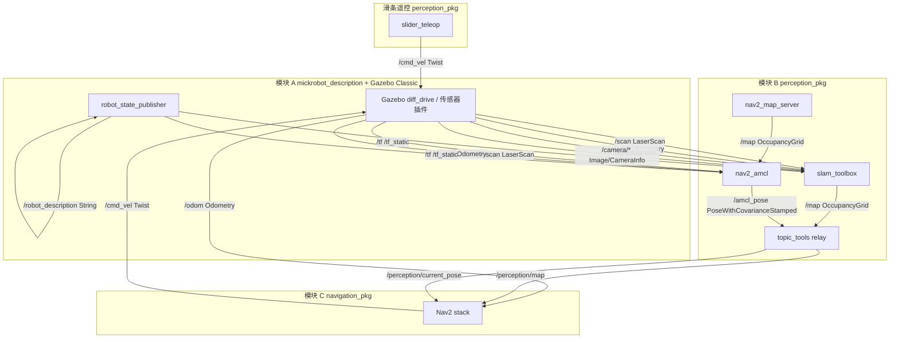

# 话题通讯图与接口说明

本文档描述工作空间 **模块 A（仿真）→ 模块 B（感知/SLAM）→ 模块 C（导航）** 之间的 ROS 2 话题关系。

---

## 1. 总体通讯图



---

## 2. 话题明细表

### 2.1 控制与运动学

| 话题 | 消息类型 | 发布者 | 订阅者 | QoS | 用途 |
|------|----------|--------|--------|-----|------|
| `/cmd_vel` | `geometry_msgs/msg/Twist` | `slider_teleop`、Nav2、`patrol_mapper` | Gazebo `diff_drive` | 默认 depth=10 | 车体中心速度指令：`linear.x`=前进 m/s，`angular.z`=转弯 rad/s |
| `/teleop/wheel_speeds` | `std_msgs/msg/Float64MultiArray` | `slider_teleop` | （调试） | 默认 | 运动学解算结果 `[v_L, v_R, ω_L, ω_R]`，不驱动仿真 |

**差速运动学**（与 URDF 一致，`L=0.18m`, `r=0.04m`）：

```text
v_left  = v - ω·L/2
v_right = v + ω·L/2
ω_wheel = v_wheel / r
```

Gazebo 内部 `libgazebo_ros_diff_drive.so` 再按相同模型驱动四轮对。

---

### 2.2 传感器（模块 A → 模块 B/C）

| 话题 | 消息类型 | 发布者 | 订阅者 | 频率 | 用途 |
|------|----------|--------|--------|------|------|
| `/scan` | `sensor_msgs/msg/LaserScan` | Gazebo 激光插件 | slam_toolbox、AMCL、RViz | ~10 Hz | 2D 建图与定位 |
| `/odom` | `nav_msgs/msg/Odometry` | Gazebo diff_drive | slam_toolbox、AMCL、Nav2、RViz | 30 Hz | 轮式里程计；含 `odom→base_footprint` TF |
| `/imu/data` | `sensor_msgs/msg/Imu` | Gazebo `imu_link`（底盘） | **EKF imu0** | 100 Hz | 车体航向 |
| `/camera/imu/data` | `sensor_msgs/msg/Imu` | Gazebo `camera_imu_link`（OAK） | 录包/视觉；**不进 EKF** | 100 Hz | 与底盘 IMU 不同安装位 |
| `/camera/left/image_raw` | `sensor_msgs/msg/Image` | Gazebo 相机 | （实车视觉 SLAM） | 30 Hz | 左目图像 |
| `/camera/left/camera_info` | `sensor_msgs/msg/CameraInfo` | Gazebo 相机 | （标定/视觉） | 30 Hz | 左目内参 |
| `/camera/right/image_raw` | `sensor_msgs/msg/Image` | Gazebo 相机 | （实车视觉 SLAM） | 30 Hz | 右目图像 |
| `/camera/right/camera_info` | `sensor_msgs/msg/CameraInfo` | Gazebo 相机 | （标定/视觉） | 30 Hz | 右目内参 |
| `/joint_states` | `sensor_msgs/msg/JointState` | Gazebo | robot_state_publisher（可选） | 30 Hz | 关节角（Classic 由插件发布） |

---

### 2.3 地图与定位（模块 B）

| 话题 | 消息类型 | 发布者 | 订阅者 | QoS | 用途 |
|------|----------|--------|--------|-----|------|
| `/map` | `nav_msgs/msg/OccupancyGrid` | slam_toolbox / map_server | RViz、relay、Nav2 | Transient Local | 原始栅格地图 |
| `/map_metadata` | `nav_msgs/msg/MapMetaData` | slam_toolbox | — | — | 地图元数据 |
| `/perception/map` | `nav_msgs/msg/OccupancyGrid` | topic_tools relay | 模块 C Nav2 | Transient Local | 对外统一地图接口 |
| `/amcl_pose` | `geometry_msgs/msg/PoseWithCovarianceStamped` | AMCL | relay、RViz | — | 定位位姿（localize 模式） |
| `/perception/current_pose` | 同上 | relay | 模块 C | — | 对外统一位姿接口 |
| `/particlecloud` | `geometry_msgs/msg/PoseArray` | AMCL | RViz | — | 粒子云（可选显示） |
| `/detection/waypoints` | `geometry_msgs/msg/PoseArray` | `clip_detector_node` | relay | — | map 帧航点（双目反投影） |
| `/detection/annotated_image` | `sensor_msgs/msg/Image` | `clip_detector_node` | RViz | — | 带绿框左目图 |
| `/detection/markers` | `visualization_msgs/msg/MarkerArray` | `clip_detector_node` | RViz | — | 地图航点可视化 |
| `/perception/mapping_finalized` | `std_msgs/msg/Empty` | `map_snapshot_saver` | `clip_detector_node` | — | 建图结束，触发航点落盘 |
| `/perception/waypoints` | 同上 | relay | 模块 C | — | 对外统一航点接口 |

---

### 2.4 模型与 TF

| 话题 | 消息类型 | 发布者 | 订阅者 | 用途 |
|------|----------|--------|--------|------|
| `/robot_description` | `std_msgs/msg/String` (XML) | robot_state_publisher | RViz、spawn_entity | URDF 全文 |
| `/tf` | `tf2_msgs/msg/TFMessage` | diff_drive、slam_toolbox、AMCL | 全局 | 动态坐标变换 |
| `/tf_static` | `tf2_msgs/msg/TFMessage` | robot_state_publisher | 全局 | 静态关节 TF |

**主要 TF 树（仿真 SLAM）**：

```text
map → odom → base_footprint → base_link → {laser_link, imu_link, camera_imu_link, camera_left_link, camera_right_link, ...}
```

建图 + 检测时 RViz **Fixed Frame 用 `map`**（航点、`/detection/markers` 均在 map 帧）。`slam_classic.rviz` 已默认 `map`。

---

### 2.6 建图会话目录（`maps/map_<时间戳>/`）

| 文件 | 写入者 | 说明 |
|------|--------|------|
| `slam_map.yaml` / `.pgm` / `.png` | `map_snapshot_saver` | 栅格地图 |
| `initial_pose.yaml` | `map_snapshot_saver` | 每秒缓存 `map→base_footprint` |
| `waypoints.yaml` | `clip_detector_node` | 去重航点列表（含 `dedup_radius_m` 元数据；每秒更新） |
| `slam_map_waypoints.png` | `clip_detector_node` | 地图叠加航点与终止位姿 |
| `.mapping_finalized` | `map_snapshot_saver` | 建图结束标记（备用） |
| `bag/` | rosbag2 | 含 `/camera/*` 等 |
| `session_meta.json` | launch / saver | 会话索引 |

---

### 2.5 模块 C 导航（Nav2，localize 模式）

| 话题 | 消息类型 | 发布者 | 订阅者 | 用途 |
|------|----------|--------|--------|------|
| `/cmd_vel` | `geometry_msgs/msg/Twist` | Nav2 controller | Gazebo | 自动导航速度 |
| `/goal_pose` | `geometry_msgs/msg/PoseStamped` | RViz / send_goal.py | Nav2 | 导航目标 |
| `/plan` | `nav_msgs/msg/Path` | Nav2 planner | RViz | 全局路径 |
| `/local_plan` | `nav_msgs/msg/Path` | Nav2 controller | RViz | 局部路径 |

---

## 3. 典型调用链

### 3.1 仿真 + 滑条建图

```text
1. humble_sim_slam.launch.py
   → bringup_classic (Gazebo + robot_state_publisher)
   → perception_humble mode=slam (slam_toolbox)

2. teleop_slider.launch.py
   → /cmd_vel → Gazebo → /odom, /scan, /tf

3. slam_toolbox
   /scan + /odom + TF → /map → relay → /perception/map

4. rviz_slam.launch.py 订阅 /map, /scan, /odom, /detection/annotated_image, /detection/markers
```

### 3.2 检测 + 航点反投影（模块 E）

```text
1. detection.launch.py → clip_detector_wrapper.sh → clip_detector_node
   订阅：/camera/left|right/image_raw, camera_info, /perception/mapping_finalized
   发布：/detection/annotated_image, /detection/waypoints, /detection/markers

2. TF：map ← camera_*_link（slam_toolbox + robot_state_publisher）

3. YOLO 左目检测 → 帧内 NMS（无数量上限）
   双目匹配 → 框中心像素 → 三角化 / 地面 fallback → map 帧航点（REP-103 光学系）

4. 航点去重（两层）
   a) 实时：ORB 词袋重识别（waypoint_reid.py）合并外观相同目标
   b) 空间：dedup_radius_m（默认 0.35 m）内加权平均位置
   c) 落盘前：deduplicate_waypoints 再过滤 → waypoints.yaml

5. 持久化
   每秒写入 waypoints.yaml；Ctrl-C 或 /perception/mapping_finalized → waypoints.yaml + slam_map_waypoints.png
   启动时若 session_dir 已有 waypoints.yaml → 加载坐标（外观库不持久化，需重新观测）

6. relay：/detection/waypoints → /perception/waypoints → 模块 C
```

**`detection_params.yaml` 关键项**：`dedup_radius_m`、`enable_reid`、`reid_match_score_min`、`reid_vocab_size`、`marker_scale_m`。

### 3.3 保存地图 → 定位 → 导航

```text
save_map.launch.py 或 humble_sim_slam 退出 → maps/map_<ts>/slam_map.yaml + .pgm

perception_humble mode:=localize
  initial_pose_file:=maps/map_<ts>/initial_pose.yaml
  → map_server + AMCL（lifecycle_manager_localization）

navigation_humble.launch.py（三终端之终端 2）
  → Nav2 节点逐个启动 + lifecycle_manager_navigation（约 25–30s 后 Managed nodes are active）
  → 订阅 /map、/scan；发布 /cmd_vel_nav → cmd_vel_guard → /cmd_vel

patrol_rviz.launch.py（终端 3）
  → waypoint_patrol + navigation.rviz
  → 结果落盘 result/path_<ts>/（mission_trajectory.png 等）
```

详见 [`README.md`](../README.md) 模块 C、[NAVIGATION_TUNING.md](NAVIGATION_TUNING.md)。

---

## 4. 消息字段速查

### geometry_msgs/msg/Twist（/cmd_vel）

| 字段 | 单位 | 说明 |
|------|------|------|
| `linear.x` | m/s | 前进为正 |
| `linear.y`, `linear.z` | — | 差速车不用 |
| `angular.z` | rad/s | 左转为正 |

### sensor_msgs/msg/LaserScan（/scan）

| 字段 | 说明 |
|------|------|
| `angle_min/max` | -π ~ π |
| `range_min/max` | 0.12 ~ 12.0 m |
| `ranges[]` | 各角度距离 |

### nav_msgs/msg/OccupancyGrid（/map）

| 字段 | 说明 |
|------|------|
| `info.resolution` | m/格，通常 0.05 |
| `info.origin` | 地图原点位姿 |
| `data[]` | -1 未知，0~100 占用概率 |

---

## 5. 启动命令与话题关系

| 终端 | Launch | 产生/消费的主要话题 |
|------|--------|---------------------|
| 1 | `humble_sim_slam.launch.py` | 发布 `/scan` `/odom` `/tf` `/map`；订阅 `/cmd_vel` |
| 2 | `rviz_slam.launch.py` | 订阅 `/map` `/scan` `/detection/annotated_image` `/detection/markers` |
| 3 | `teleop_slider.launch.py` | 发布 `/cmd_vel`；可调用 `save_map` 服务 |
| 4 | `detection.launch.py` | 订阅 `/camera/*`；发布 `/detection/*`；写会话目录航点文件 |

---

*文档版本：2026-06-13，对应 TaskA v5 + Humble + Gazebo Classic + 模块 E 检测航点。*
